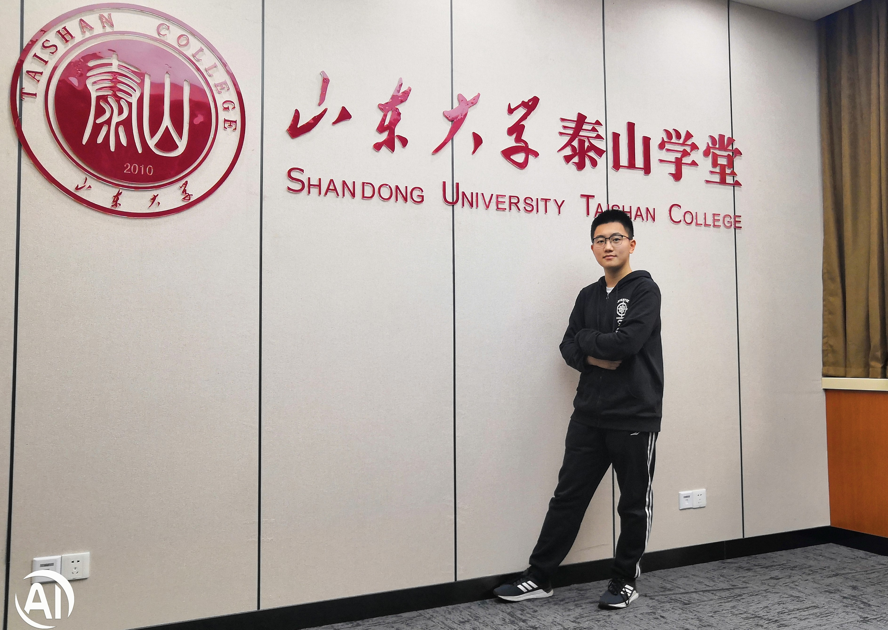

# Zhang Zuyuan(张祖源)

Hi, I’m Zhang Zuyuan, a current undergraduate student at Taishan College, Shandong University .( About Taishan College : An elite and highly selective honor school for students in mathematics, physics, chemistry, biology and computer science. Taishan College serves as a training ground for top-notch students in these basic disciplines and has been part of “The Everest Program” surpervised by the Ministry of Education of Chinese Government since its establishment. It takes in about 15 students among 300+ applicants per major every year. ) Before that, I graduated from NO.1 middle school of Wulian .

# Research

# Interests

# experience

# Service
- the general secretary of Oops community Communist Youth League
